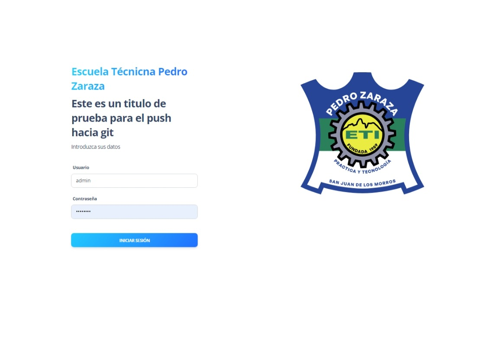

# Manual de Uso - Sistema de Control de Estudio  para la Escuela Técnica Industrial Pedro Zaraza 📘

## Descripción del Sistema 🚀
Este sistema desarrollado para la Escuela Técnica Industrial Pedro Zaraza tiene como objetivo principal automatizar y mejorar la gestión de las actividades diarias relacionadas con el control de estudios en la institución. Permite el registro y administración de datos académicos, la generación de plantillas para diferentes procesos y la optimización de tareas.

## Inicio de sesión 💻
Para acceder al sistema, deberá proporcionarle el usuario y la contraseña.

## Configuración del Sistema 🛠️
 En este módulo se le proporcionará los datos requerimos para óptima funcionalidad de los otros módulos respectivos. 
 
 
 
 
 
 
  

## Creación de Materias 📚
Este módulo se registran los nombres de las materias, se asigna si es literal y seleciona si la materia creadar pertenece a una mención respectiva. 

## Registro de profesores 💼
En este módulo se le asignará todos los datos del dicho docente y posteriormente se le asignará una o varias materias

## Registro Estudiantes 👩‍🎓
En este módulo se le asignará todos los datos del alumnado y posteriormente se le asignará la opción si es Regular, Materia Pendiente o Repitiente 

## Generar Boletas 📝
Este módulo se selecciona año escolar, mención, año y sección para generar el respectivo boletín.

## Registro de Planillas 🗂️
Acá las planillas poseen el modelo estilo Excel para su llenado en sus celdas con datos necesarios. Una vez finalizado, está la opción de generarlo como PDF para descarga y/o impresión 

## Licencia 📄

Este proyecto está licenciado bajo la Licencia MIT. Ver el archivo LICENSE para más detalles.

## Autor/es ✍️

- Daniel Escalona - [GitHub](https://github.com/DanielEsc0911)

## Colaboradores 🖥️👾

- Sergio Hurtado - [GitHub](https://github.com/HSerch19)
- Daniel De Freitas - [GitHub](https://github.com/)
- Georgelys Herrera - [GitHub](https://github.com/georgbztt)
- Douglas Montoya - [GitHub](https://github.com/DouglasMontoya)